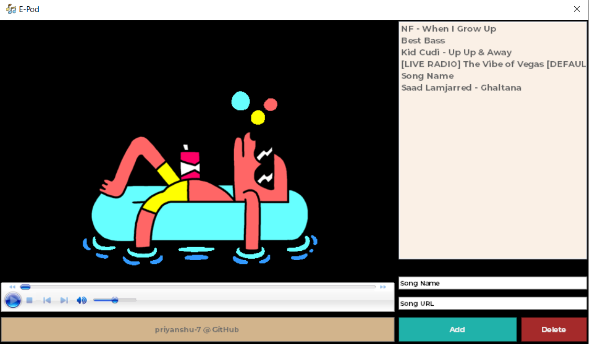

#E-Pod: A URL based music player#

#Features#
##* Add music to playlist using only direct .mp3/.m4a links (no need to actually download them)*##mu
##* Music is auto saved upon reopening the app *##
##* Delete music feature *##
##* Auto-sync list on different desktops *##

#Installation#
## * Open project in Visual Studio or any relevant IDE * ##
## * Edit **connstring** variable in Form1.cs using relevant database details (SQL table is automatically created) * ##
## * Click on RUN to build a .exe * ##
